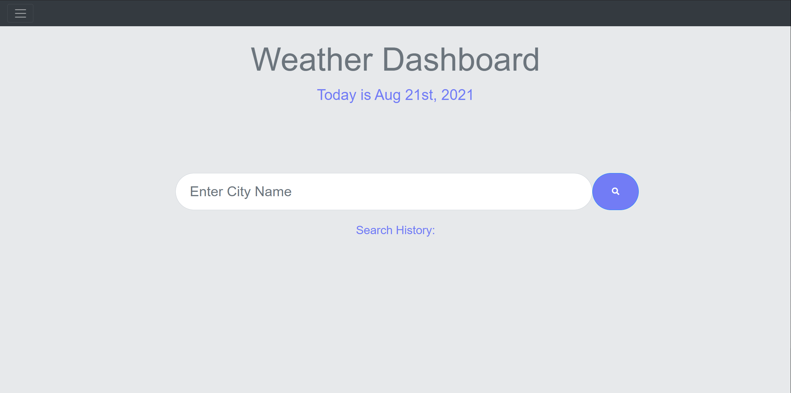
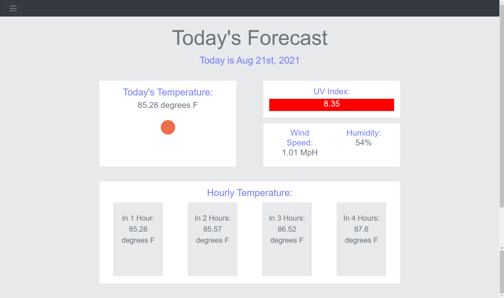
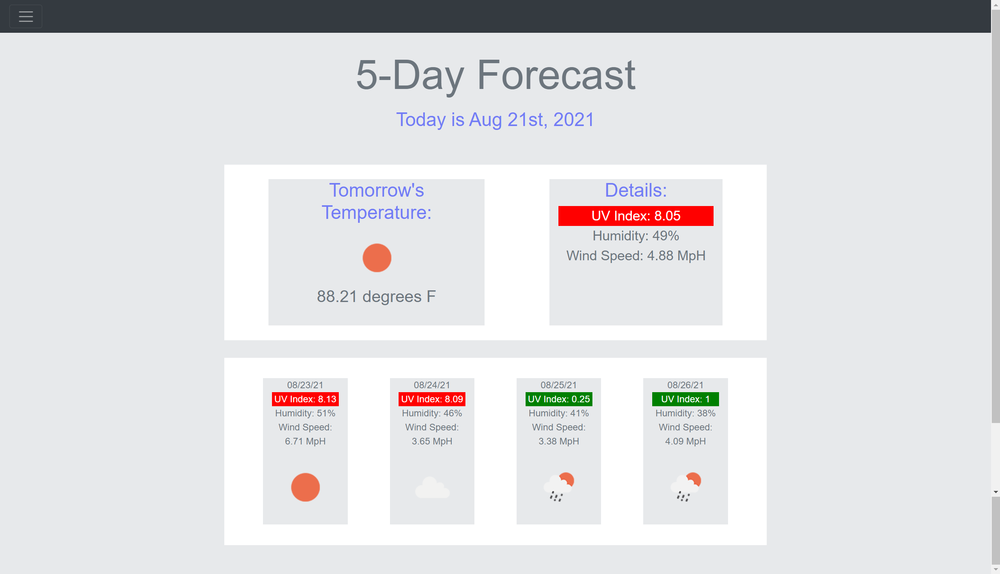
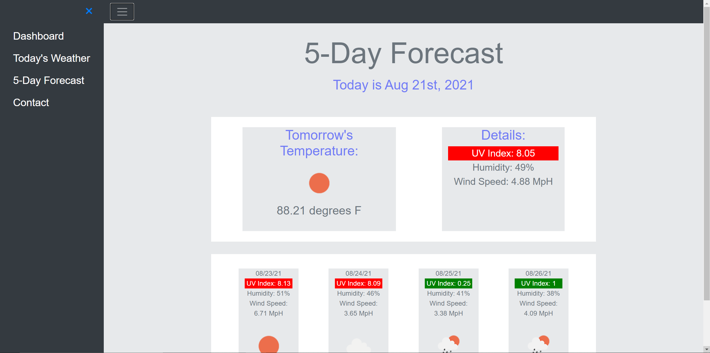

# Weather-Dashboard

## Description

This is a one stop for all weather information in a particular city. When a user inputs a city name, he/she will be taken to the current day's forecast of that city. Information will include:

* temperature
* uvi
* wind speeds
* humidity
* and the forecast over the next 5 hours

The user can then see the forecast with the same information for the next 5 days.

The user's search history will be displayed on the dashboard page. The user can follow that history to see weather data for that city again.

## Use

1. Enter a city name and press the search icon or click a city name from the search history
2. View the relevant weather data for the current day
3. Click the navbar icon to display the sidebar
4. Click the 5-day forecast option to view the forecast over the next 5 days
5. Click the navbar button again and click the dashboard option to go back to the dashboard

## Screenshots

## Links

https://github.com/ccardinale98/weather-dashboard
https://ccardinale98.github.io/weather-dashboard/